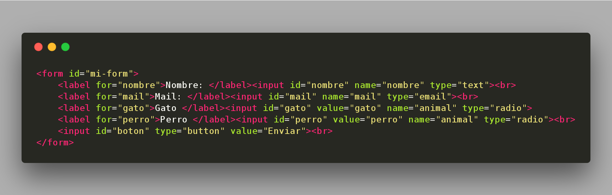

# Clase 4
### En esta clase:

- Repasamos lo que habiamos trabajado sobre el formulario
- El objetivo principal es pasar lo que hayamos hecho a una applicación móvil usando phonegap

##### Slides - Presentación:
Las slides las pueden ver haciendo click [acá](https://ptf-houssay.github.io/taller-mobile/clase-4/slides-cuarto-encuentro.html)

---

### Primeros pasos en phonegap

Para instalar phonegap seguir las instrucciones detalladas [acá](https://phonegap.com/getstarted/)

Podemos usar la consola o la interfaz gráfica para crear un proyecto


##### Consola
Para los que usen **consola** vamos a comenzar con un proyecto base de la siguiente manera:
```bash
$ phonegap create hola-mundo
$ cd hola-mundo
$ phonegap serve
```

##### Interfaz Gráfica (Windows o Mac)
Aquellos que usen la interfaz gráfica disponible para sistemas operativos Windows o Mac pueden crear un nuevo proyecto de la siguiente manera:


#### Estructura de directorios


La carpeta www en la que nos vamos a estar enfocando por ahora. Ahí esta todo nuesto js css y html para nuestra aplicación. El index.html será la primer vista de nuestra app.

En index.html vamos a reemplazar el codigo ya existente en el body para dejar solo nuestro formulario (o lo que hayan desarrollado hasta el momento)



#### ¿Cómo se ve nuestra aplicación?

Para no tener que estar empaquetando nuestra aplicación con cada pequeño cambio podemos usar las herramientas de desarrollador de nuestro navegador (F12) y seleccionar la opción de ver como un dispositivo móvil. Es el segundo icono (de izq a der) de la barra de opciones (la que tiene Elements/Console/Application/etc)


### Phonegap Build [Link](https://build.phonegap.com/)

Una vez que hayamos hecho los cambios que queríamos en nuestro proyecto lo vamos a comprimir y vamos a usar phonegap build para empaquetarlo y conseguir un .apk para nuestros dispositivos.

Para esto nos vamos a dirigir al siguiente [link](https://build.phonegap.com/) y vamos a seleccionar el plan gratuito (Completely Free), ingresar con email y password o crear un nuevo usuario. Una vez que hayamos ingresado nos vamos a dirigir a la opción que dice "Apps" y seleccionamos la opción "+ new app". Por último elegimos la opción "Upload a .zip file" y comezara el proceso de "build" de nuestra app, dandonos como resultado una apk instalable en dispositivos android.

---

### Contacto

Les dejo nuevamente el [link](http://bit.ly/slack-houssay) para que puedan ingresar a slack aqullos que todavía no lo hicieron, ya que ahí vamos a poder estar un contacto mas directo para dudas. La idea es que se unan al "channel" de phonegapp para eso tienen que hacer click en donde dice "Channels" y buscar phonegap y elegir "Join Channel"

También pueden enviar mensajes directos haciendo lo mismo pero con la opción "Direct Messages"

Como siempre me se pueden contactar mandando un mail a juan.cuiule@bue.edu.ar