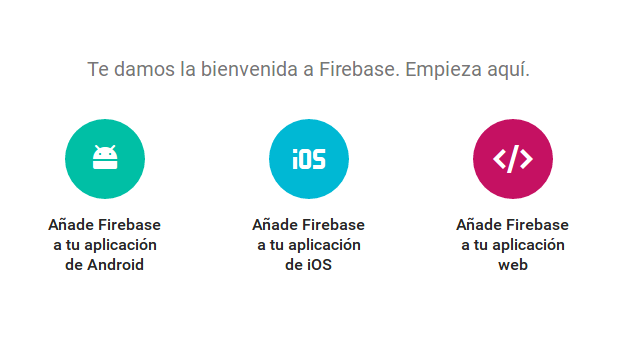
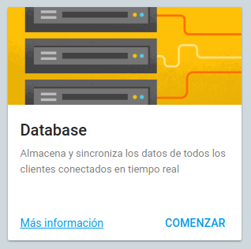
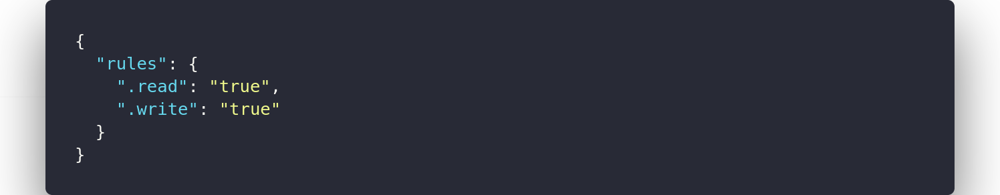
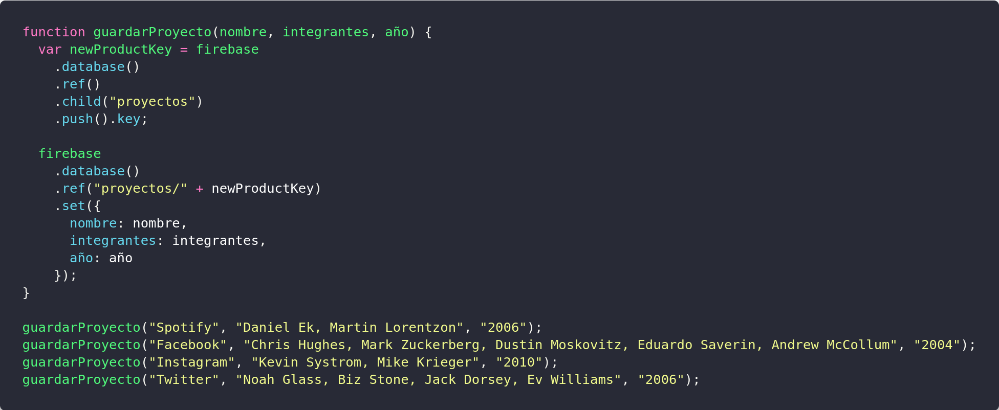
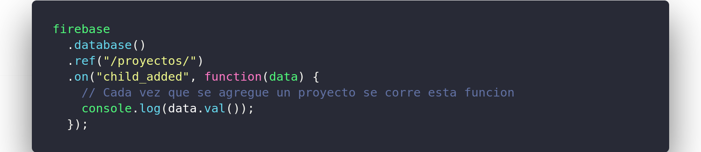

# Clase 8

##### Slides - Presentación:
Las slides las pueden ver haciendo click [acá](https://ptf-houssay.github.io/taller-mobile/clase-8/slides-clase-8.html)

### En esta clase:

- Empezamos a usar la base de datos en tiempo real de firebase.
- Vimos dos ejemplos de aplicaciones usando firebase
  - Manejo de stock (ver [aquí](https://github.com/ptf-houssay/ptf-firebase/tree/master/stock))
  - Registro de proyectos (ver [aquí](https://github.com/ptf-houssay/ptf-firebase/tree/master/proyectos))  

#### Crear un proyecto e iniciar la DB (database)

Para poder empezar a usar la base de datos y cualquier otro servicio de firebase tenemos que crear un proyecyo.
- Para esto vamos a la  [consola de administración de firebase](https://console.firebase.google.com)
- Copiá el código de inicialización en el archivo index.html. Lo podés hacer clickeando el logo rojo de HTML en la esquina superior derecha de la página con el nombre "Add Firebase to your web app" ("Agregar Firebase a tu app web"). El código que aparece debe ubicarse dentro de la etiqueta `<head>` del `index.html`. 
  
- Empezamos a usar nuestra base de datos 
  
- Solo por fines practicos vamos a modificar las "Reglas" de nuestra base de datos para que cualquiera pueda leer y escribir
  Para esto vamos a la perstaña "Reglas" y dejamos la configuración de la siguiente manera
  

#### Guardando datos

#### Consultando

---

### Contacto

Les dejo nuevamente el [link](http://bit.ly/slack-houssay) para que puedan ingresar a slack aqullos que todavía no lo hicieron, ya que ahí vamos a poder estar un contacto mas directo para dudas. La idea es que se unan al "channel" de phonegapp para eso tienen que hacer click en donde dice "Channels" y buscar phonegap y elegir "Join Channel"

También pueden enviar mensajes directos haciendo lo mismo pero con la opción "Direct Messages"

Como siempre me se pueden contactar mandando un mail a juan.cuiule@bue.edu.ar